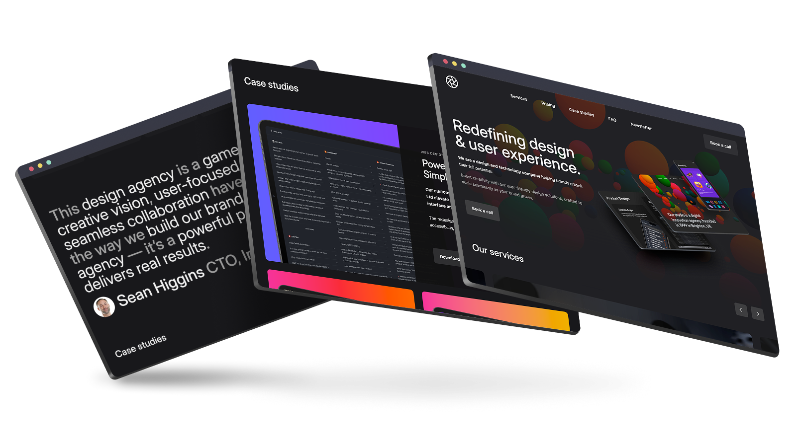
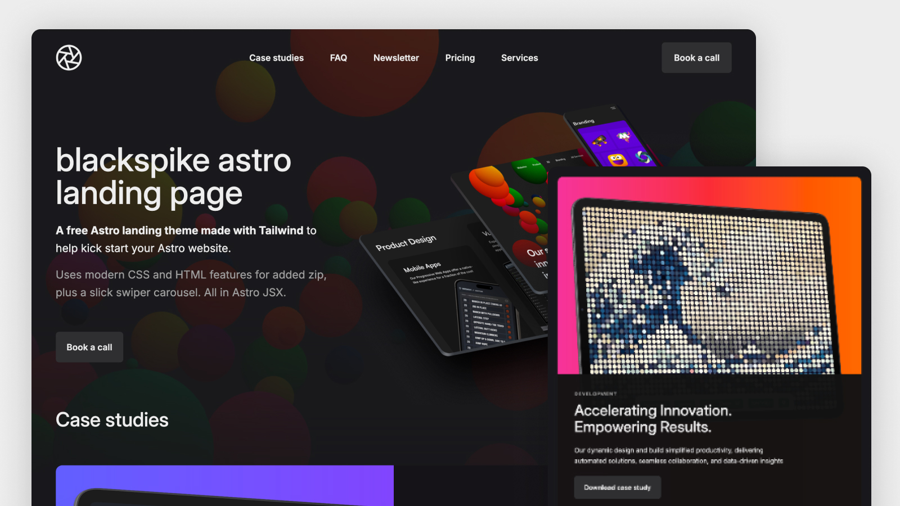
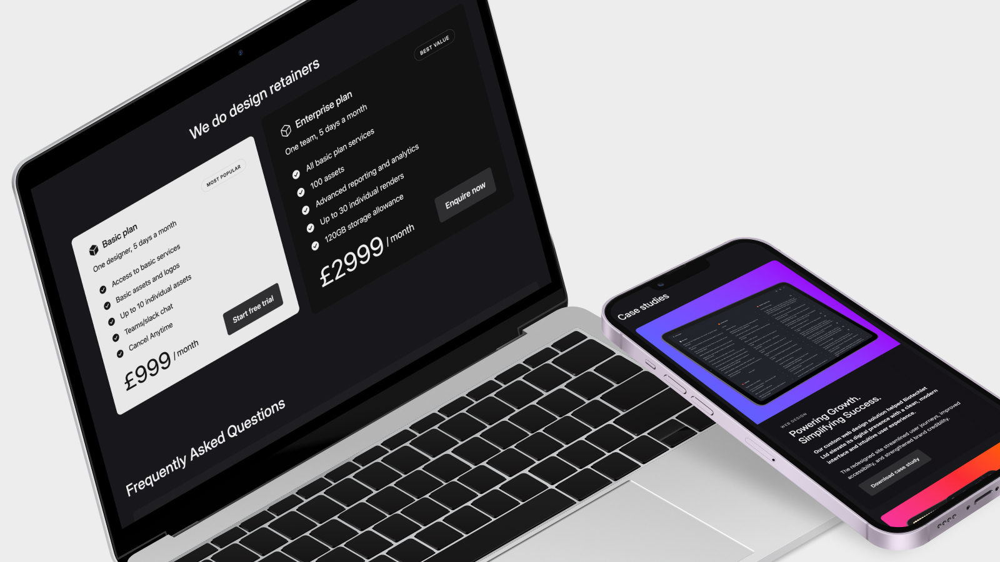
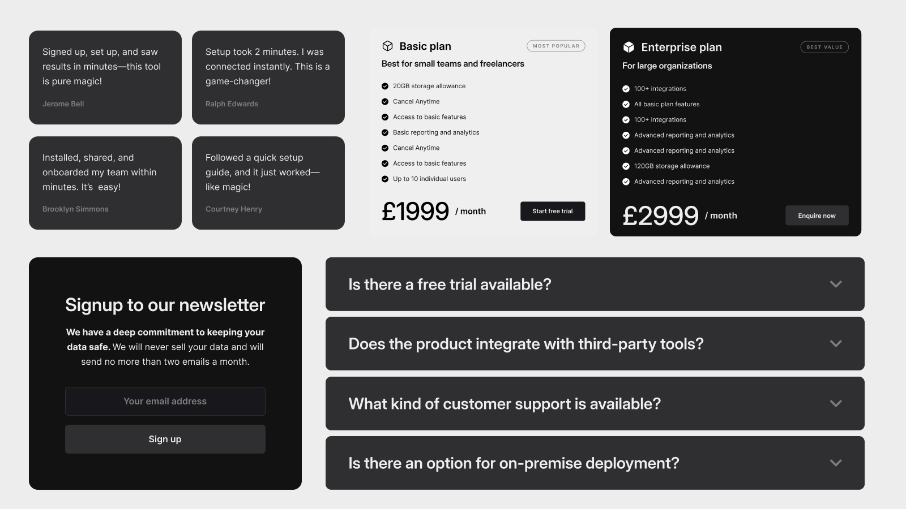

# blackspike astro landing page

## A free, modern, [Astro](https://astro.build/) landing page theme made with [Tailwind](https://tailwindcss.com/) to help kick start your next Astro project

We built this page as the first version of our own website, [blackspike.com](https://www.blackspike.com), but switched to a different design later.

Rather than let it gather dust we should modernise it, try out some fresh new CSS features and give it back to the Astro community.

We hope you find it useful!

Theme and 3D images are all by <a href='https://www.blackspike.com'>blackspike</a> and licensed under <a href='https://creativecommons.org/licenses/by/4.0/'>CC BY 4.0</a>

## Astro 5 Features

- [Image component](https://docs.astro.build/en/guides/images/#display-optimized-images-with-the-image--component) for optimised AVIF images
- All-[JSX](https://docs.astro.build/en/reference/astro-syntax/) native astro components
- SVGs imported as [SVG components](https://docs.astro.build/en/guides/images/#svg-components)
- JSON-powered content (easy to edit UI text or hook up a CMS!)
- 100% lighthouse scores
- Experimental [Fonts API](https://docs.astro.build/en/reference/experimental-flags/fonts/)

## CSS & HTML Features

- [Tailwind 4](https://tailwindcss.com/blog/tailwindcss-v4)
- HTML modal dialog
- JS-free scroll-linked animations
- JS-free exclusive accordions with details/summary (animated!)
- Container queries
- Linear easing for bouncing / springing
- Text wrap pretty / balance

## JS Features

- [swiper.js](https://swiperjs.com/) carousel

## Tags

#tailwind #tailwind4 #astro #landingPage #css #html #swiper #dark #theme

## Previews

## Commands

All commands are run from the root of the project, from a terminal:

| Command                   | Action                                           |
| :------------------------ | :----------------------------------------------- |
| `npm install`             | Installs dependencies                            |
| `npm run dev`             | Starts local dev server at `localhost:4321`      |
| `npm run build`           | Build your production site to `./dist/`          |
| `npm run preview`         | Preview your build locally, before deploying     |
| `npm run astro ...`       | Run CLI commands like `astro add`, `astro check` |
| `npm run astro -- --help` | Get help using the Astro CLI                     |

